## Question 1. You are a junior network administrator tasked with setting up a basic network using two routers, one switch, and two PCs. The goal is to establish end-to-end communication between two LANs connected via a WAN link. You will also configure security settings, basic interface descriptions, and routing to ensure proper network functionality.

### Task 1: Router Initialization (30 min)
#### Erase any existing configurations on both routers (R1 & R2)

```
enable
erase startup-config
```

#### Reload routers and ensure a fresh configuration.

```
reload
```

#### Disable auto-setup mode if prompted.

type no and press Enter.

---

### Task 2: Basic Router Configuration
#### 1. Set the hostname for both routers (R1 & R2) as Roll Number_RouterNumber 

```
enable
configure terminal
hostname T24CS003_R1
```

```
enable
configure terminal
hostname T24CS003_R2
```

#### 2. Configure MOTD banner: "Unauthorized access is prohibited!"

```
banner motd #Unauthorized access is prohibited!#
```

#### 3. Set password protection:
- Enable secret password: secure123
```
enable secret secure123
```
- Console password: cisco
```
line console 0
password cisco
login
```

- VTY password: cisco123

```
line vty 0 4
password cisco123
login
```


#### 4. Ensure console sessions do not time out.

```
line console 0
exec-timeout 0 0
```

#### 5. Enable logging synchronous on the console for smooth command execution.

```
line console 0
logging synchronous
exit
```

#### Save the configuration:

```
write memory
```

---

## **Task 3: Interface Configuration**

1. Enter global configuration mode:
   ```
   configure terminal
   ```
2. Configure Fa0/0: LAN
   ```
   interface fa0/0
   ip address 192.168.1.1 255.255.255.0
   description Connected to SW1
   no shutdown
   ```
3. Configure Se0/1/0: WAN
   ```
   interface se0/1/0
   ip address 10.0.0.1 255.255.255.252
   description WAN Link to R2
   clock rate 64000
   no shutdown
   exit
   ```

### **Steps for R2:**
1. Enter global configuration mode:
   ```
   configure terminal
   ```
2. Configure Se0/1/0 (WAN interface, DTE end):
   ```
   interface se0/1/0
   ip address 10.0.0.2 255.255.255.252
   description WAN Link to R1
   no shutdown
   ```
3. Configure Fa0/0 (LAN interface):
   ```
   interface fa0/0
   ip address 192.168.2.1 255.255.255.0
   description Connected to PC2
   no shutdown
   exit
   ```
4. Save configurations on both routers:
   ```
   write memory
   ```

Similarly, configure the interfaces for Laptop1 and Laptop2.

---

## **Task 4: Configure Static Routing**

### **Steps for R1:**
1. Add a static route to R2’s LAN:
   ```
   configure terminal
   ip route 192.168.2.0 255.255.255.0 10.0.0.2
   exit
   ```

### **Steps for R2:**
1. Add a static route to R1’s LAN:
   ```
   configure terminal
   ip route 192.168.1.0 255.255.255.0 10.0.0.1
   exit
   ```

---

## **Task 5: Switch Configuration**

### **Steps for SW1:**
1. Enter global configuration mode:
   ```
   enable
   configure terminal
   ```
2. Set the hostname:
   ```
   hostname T24CS003_SW1
   ```
3. Configure VLANs:
   ```
   vlan 10
   name PC1_VLAN
   exit
   ```
4. Assign Fa0/1 (to PC1) to VLAN 10:
   ```
   interface fa0/1
   switchport mode access
   switchport access vlan 10
   description Connected to PC1
   ```
5. Configure Fa0/24 (to R1) as a trunk:
   ```
   interface fa0/24
   switchport mode trunk
   switchport trunk allowed vlan 10
   description Trunk to R1
   ```
6. Save the configuration:
   ```
   write memory
   ```

---

## **Task 6: End-to-End Connectivity Test**

**Objective:** Configure PCs and verify connectivity.

### **Steps:**
1. **Configure PC1:**
   - Click PC1, go to **Desktop** > **IP Configuration**.
   - Set:
     - IP Address: 192.168.1.10
     - Subnet Mask: 255.255.255.0
     - Default Gateway: 192.168.1.1
2. **Configure PC2:**
   - Click PC2, go to **Desktop** > **IP Configuration**.
   - Set:
     - IP Address: 192.168.2.10
     - Subnet Mask: 255.255.255.0
     - Default Gateway: 192.168.2.1
3. Similarly, configure Laptop1 and Laptop2.
4. **Test Local Connectivity:**
   - From PC1’s command prompt: `ping 192.168.1.1`.
   - From PC2’s command prompt: `ping 192.168.2.1`.
   - From Laptop1’s command prompt: `ping 192.168.1.1`, `.2.1`, `.3.1`....
   - From Laptop2’s command prompt: `ping 192.168.1.1`, `.2.1`, `.3.1`....
5. **Test WAN Connectivity:**
   - From R1: `ping 10.0.0.2`.
6. **Test End-to-End Connectivity:**
   - From PC1: `ping 192.168.2.10`.

**Screenshots/Terminal Outputs:**

**1. On R1 and R2: `show running-config`, `show ip route`, `show ip interface brief`.**

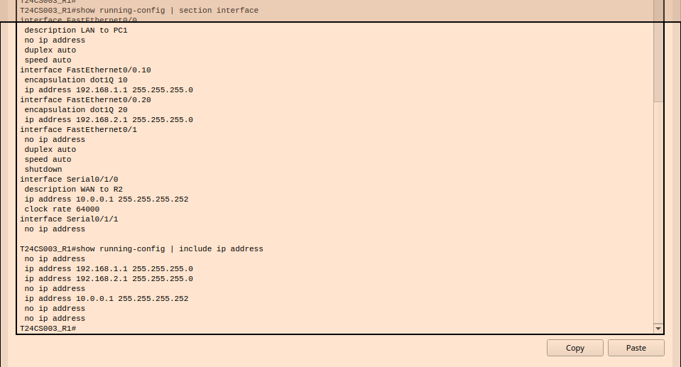{#fig:R1_Config}
**Figure 1: R1 Running Configuration**

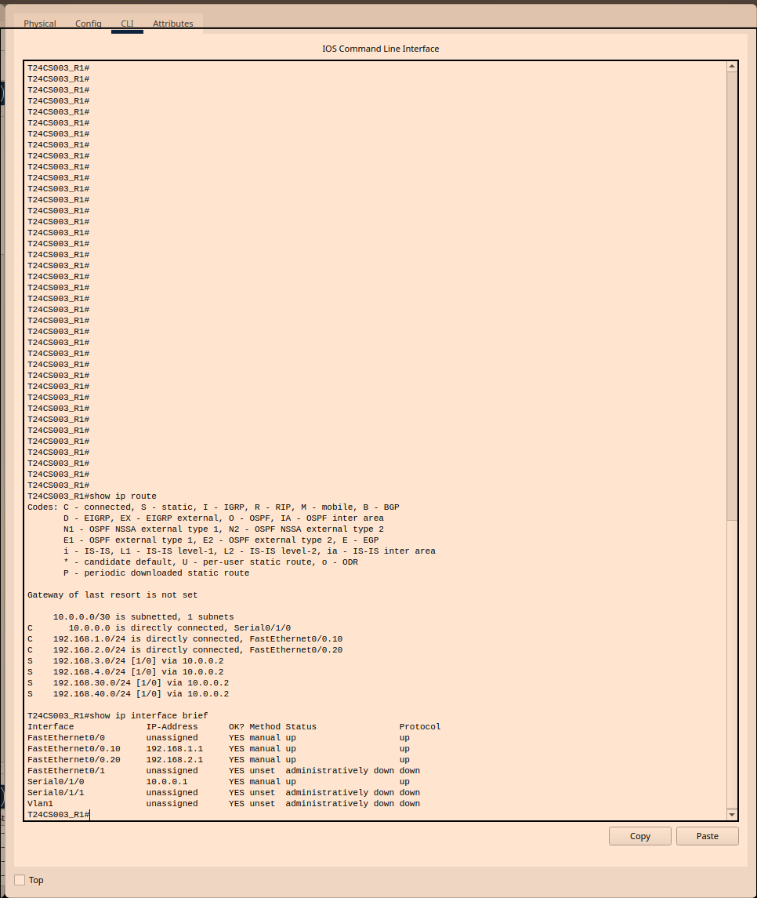{#fig:R1_IP_Interface}
**Figure 2: R1 IP Route and R1 IP Interface Brief**

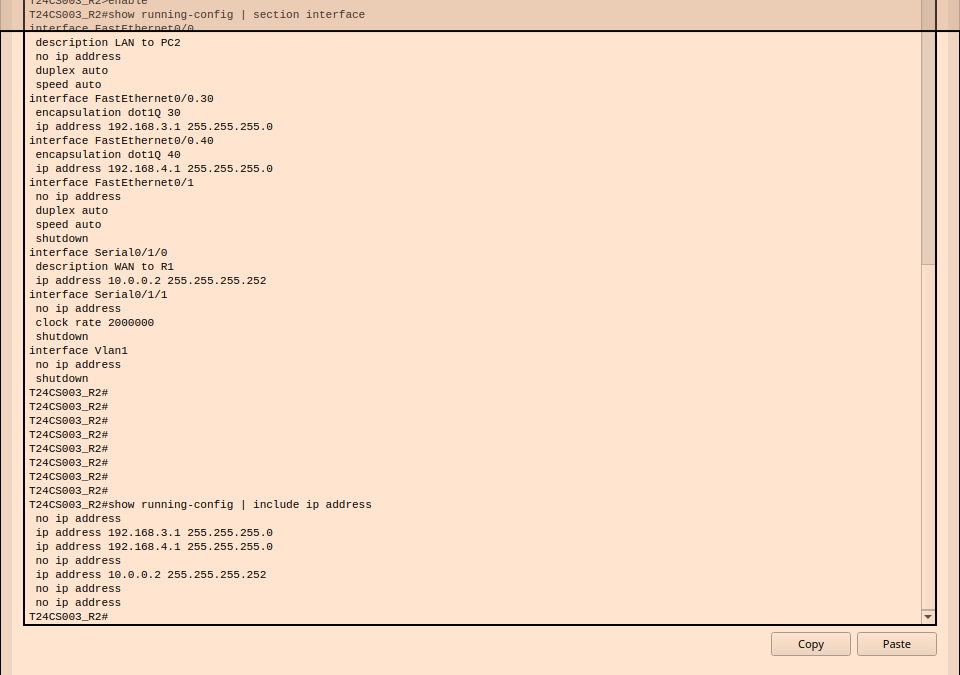{#fig:R2_Config}
**Figure 3: R2 Running Configuration**

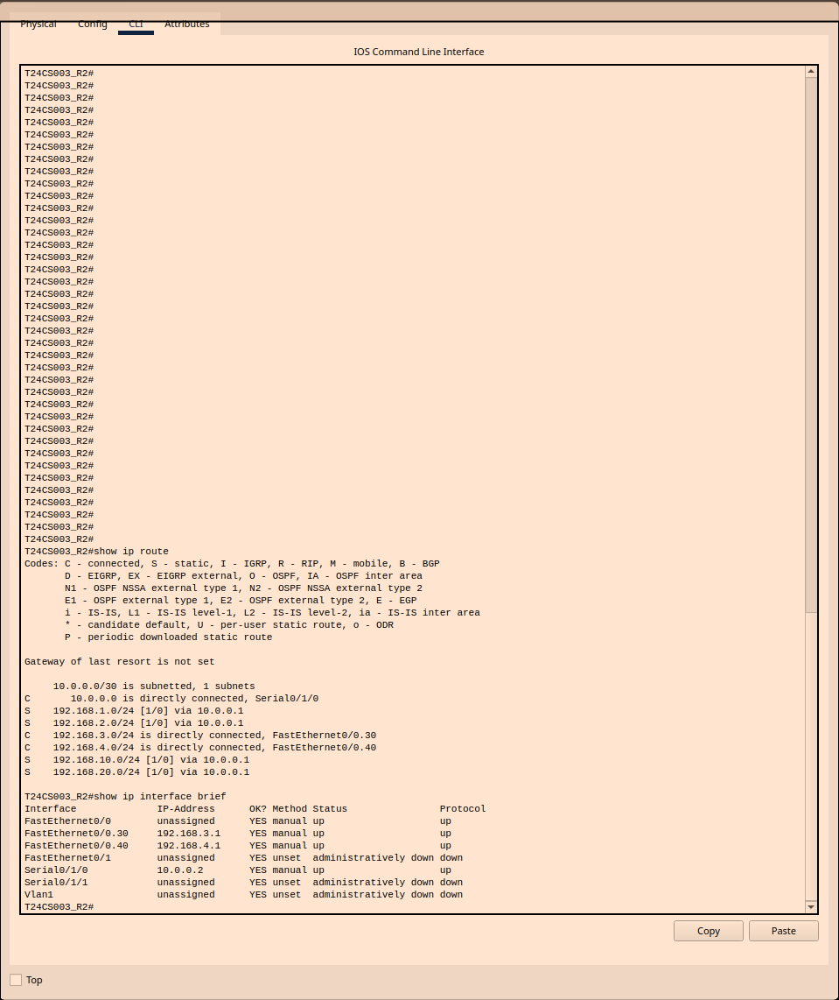{#fig:R2_IP_Interface}
**Figure 4: R2 IP Route and R2 IP Interface Brief**

**2. On SW1: `show running-config`, `show vlan brief`.**

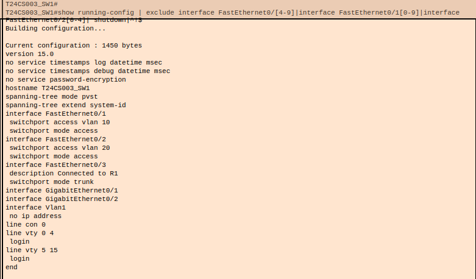{#fig:SW1_Config}
**Figure 5: SW1 Running Configuration**

{#fig:SW1_VLAN}
**Figure 6: SW1 VLAN Brief**

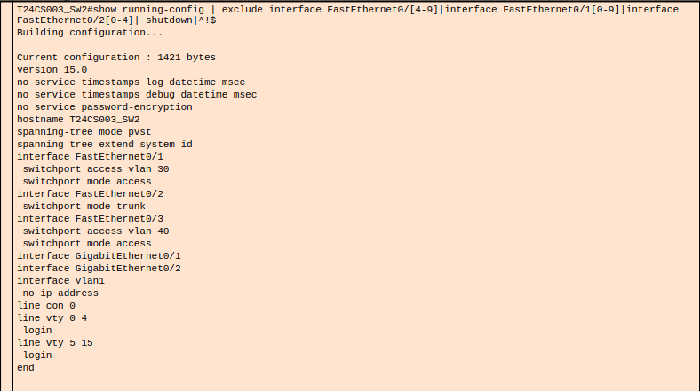{#fig:SW2_Config}
**Figure 7: SW2 Running Configuration**

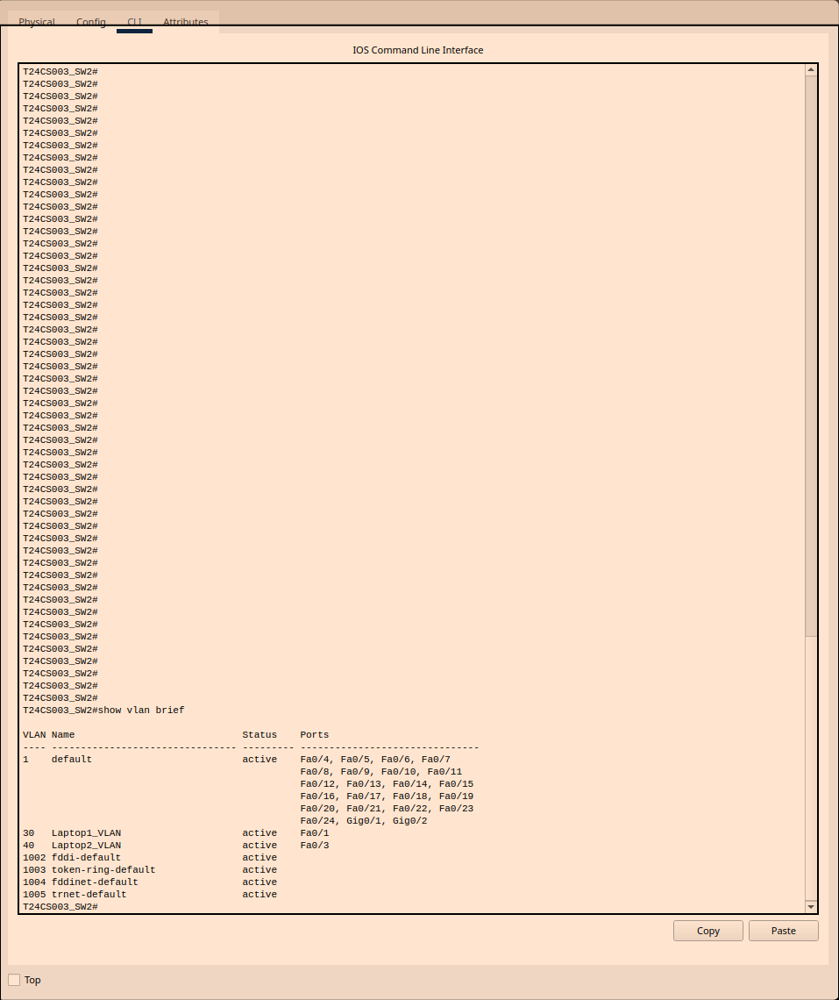{#fig:SW2_VLAN}
**Figure 8: SW2 VLAN Brief**

**3. Ping results from PC1, PC2, Laptop1 and Laptop2.**

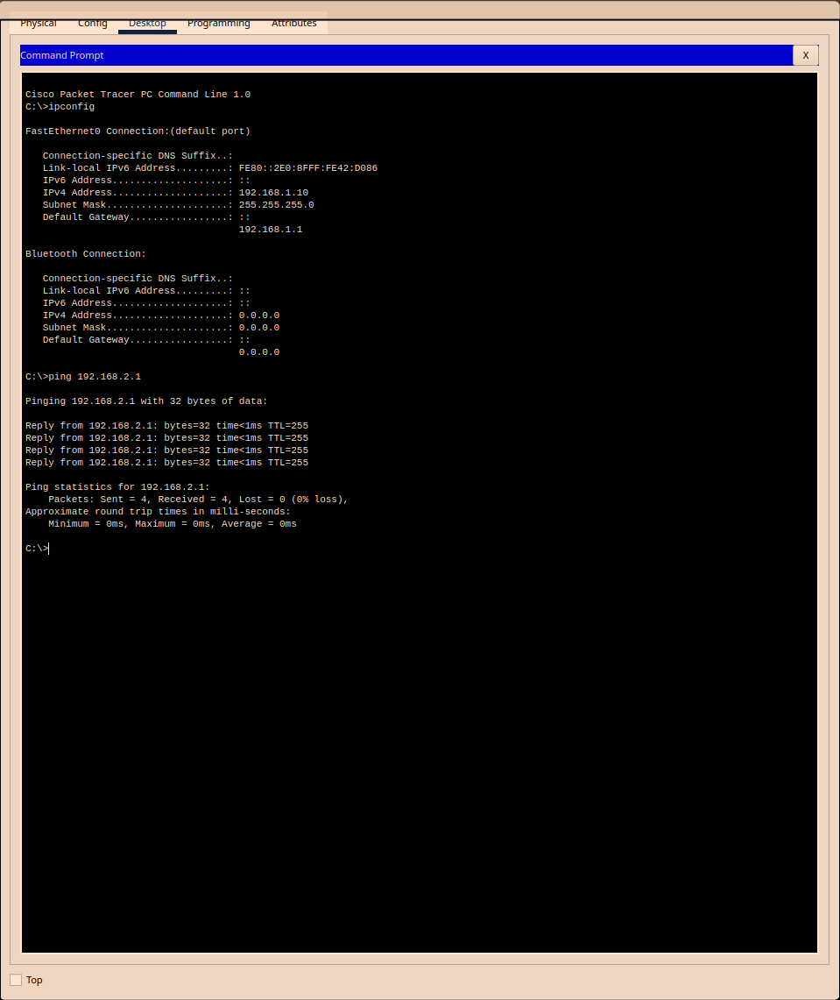{#fig:PC1_Ping}
**Figure 9: PC1 Ping**

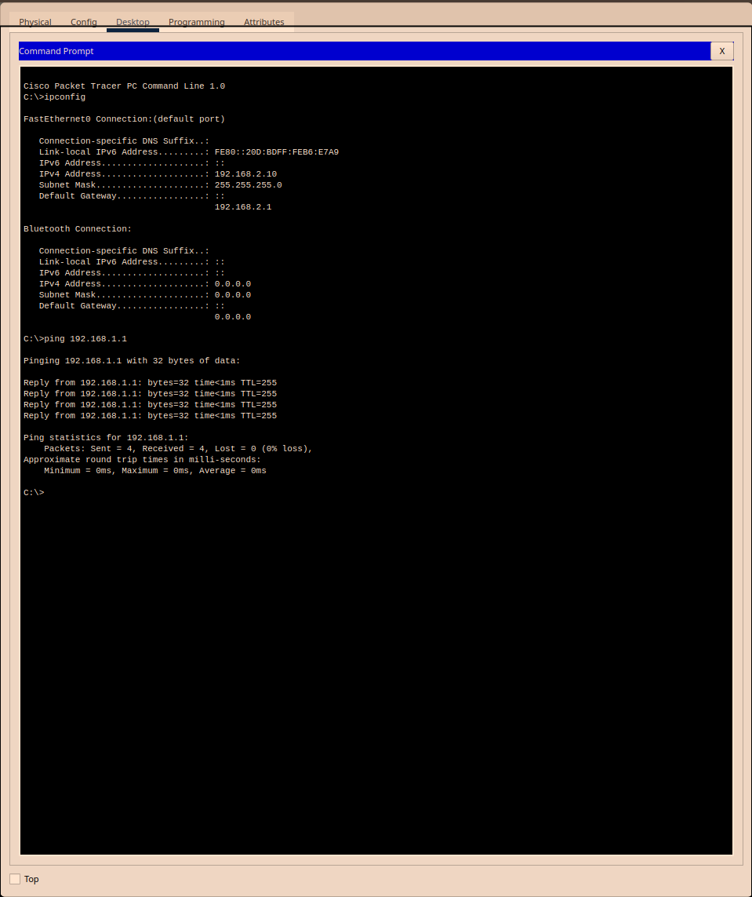{#fig:PC2_Ping}
**Figure 10: PC2 Ping**

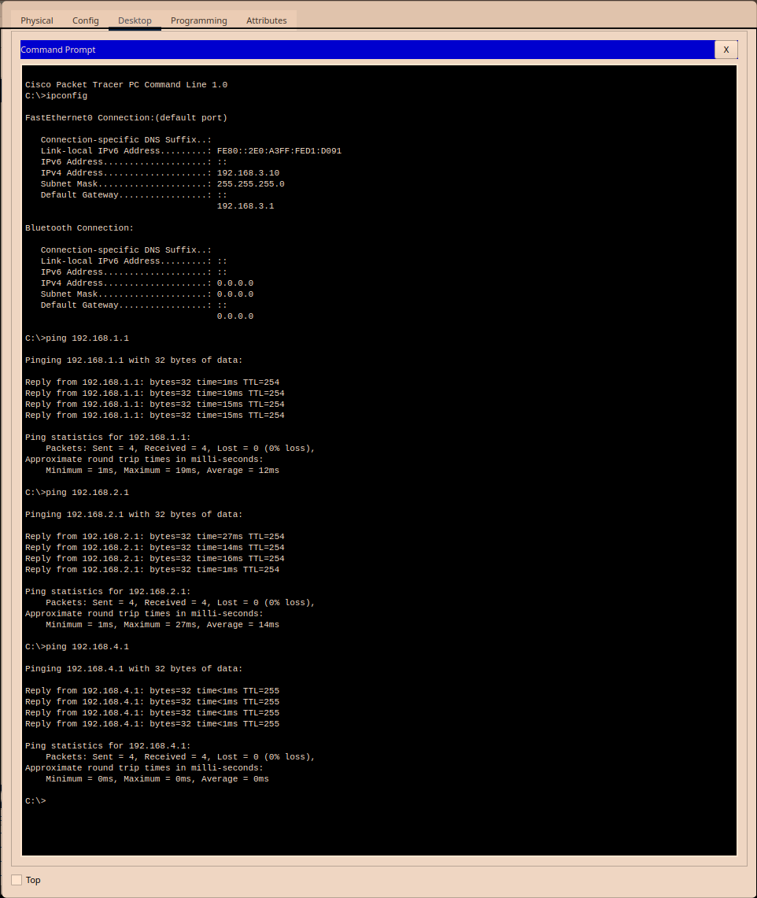{#fig:Laptop1_Ping}
**Figure 11: Laptop1 Ping**

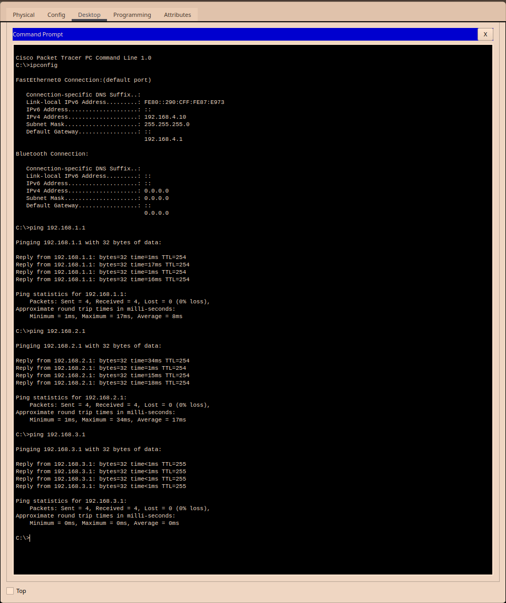{#fig:Laptop2_Ping}
**Figure 12: Laptop2 Ping**
